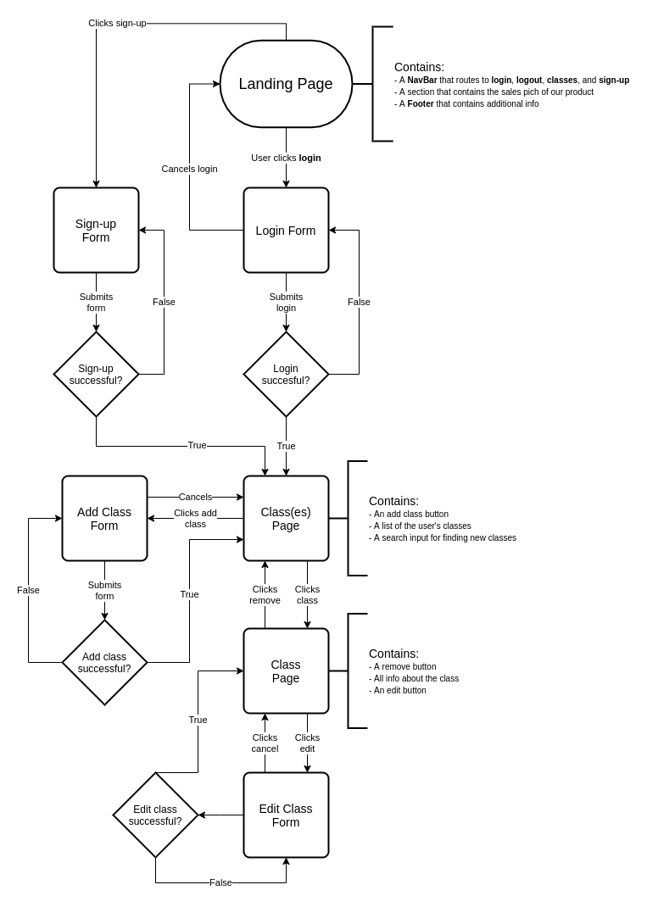

# Anywhere Fitness Front-end

## Project Setup

1. Clone down the project (do **not** fork the repository).

2. While in the root directory of the project, run `npm install` to install all of the project dependencies.

3. Run `npm start` to start up the app.

4. Before merging a branch, run `git pull origin main` to stay up to date with `main`.

5. When you pull from `main`, be sure to run `npm install` to update your dependencies.

## Git Flow

- For this project, please read and follow [this guide](https://www.notion.so/Git-for-Build-Sprint-20ce2d09dc0e47b1af5d51821b54b810) that was provided by Edd Burke.

- Make sure to **not** work directly on `main`. Always create a feature branch with an appropriate name.

- Post in Slack ahead of time what feature you will be working on in the app, so that people don't accidentally work on the same feature. Communication is key!

- Please post every pull requests you make into the Slack channel when it is ready for review. This step is essential to keep us all on the same page. Every pull request needs at least one review before it can be merged (this should prevent merge conflicts from happening).

## Flowchart of App State

## ☝️ **Pitch**

These days, fitness classes can be held anywhere- a park, an unfinished basement or a garage- not just at a traditional gym. Certified fitness instructors need an easy way to take the awkwardness out of attendance taking and client payment processing.

While you could use several mobile apps to accomplish this, **AnywhereFitness** is the all-in-one solution to meet your “on-location” fitness class needs. AnywhereFitness makes it painless for Instructors and Clients alike to hold and attend Fitness classes wherever they might be held.

Instructors can take attendance, request and process payments, create virtual “punch passes” for each type of class offered, alert clients of cancellations or location changes and so much more. Clients can easily find out information on classes - location, class size, start time and duration, as well as reschedule or cancel an upcoming appointment or reservation right from the mobile app.

## ✅  **MVP**

1. User can create/register as a `client` and login with the registered credentials.

2. User can create/register as an `instructor` by entering an additional Auth Code during signup, and can login with the registered credentials.

3. `client` and `instructor` are both presented with the appropriate on-boarding walkthrough on first sign-in, with an option to skip it.

4. Authenticated `Instructor` can create update and delete a `class`. At a minimum, each `class` must have the following properties:

- `Name`
- `Type`
- `Start time`
- `Duration`
- `Intensity level`
- `Location`
- `Current number of registered attendees`
- `Max class size`

5. Authenticated `client` can search for available classes. At a minimum, they must be able to search by the following criteria:

- `class time`
- `class date`
- `class duration`
- `class type`
- `intensity level`
- `class location`

6. Authenticated `instructor` can create virtual punch pass categories for each type of group fitness class they offer (yoga, insanity, RIPPED, pilates, etc.)

7. Authenticated `user` can reserve a spot in a `class` with available seats open, and can reschedule or cancel their current `reservation` from the mobile app.

## 🏃‍♀️**Stretch**

- Implement payments using PayPal, Stripe or another 3rd party API.
